# CinematicAI Studio — Architecture Diagrams

> Generated from exhaustive line-by-line analysis of every source file in the repository.
> See `AUDIT-2026-07-19.md` for the full audit report.

---

## 1. System Topology — Infrastructure & Services

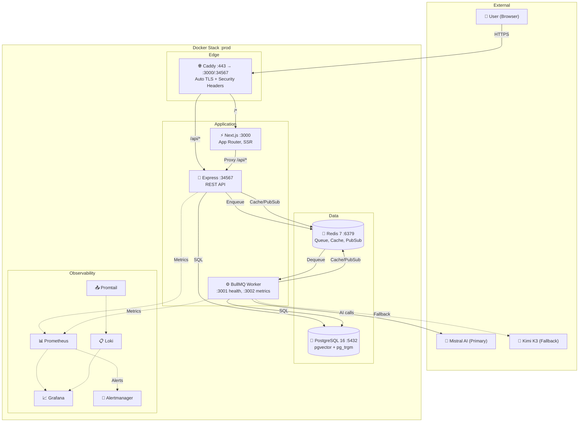
```mermaid
graph TB
    subgraph External
        USER["👤 User (Browser)"]
        MISTRAL["🤖 Mistral AI (Primary)"]
        KIMI["🤖 Kimi K3 (Fallback)"]
    end

    subgraph "Docker Stack :prod"
        subgraph "Edge"
            CADDY["🌐 Caddy :443 → :3000/:34567<br/>Auto TLS + Security Headers"]
        end

        subgraph "Application"
            FE["⚡ Next.js :3000<br/>App Router, SSR"]
            BE["🔧 Express :34567<br/>REST API"]
            WORKER["⚙️ BullMQ Worker<br/>:3001 health, :3002 metrics"]
        end

        subgraph "Data"
            PG[("🐘 PostgreSQL 16 :5432<br/>pgvector + pg_trgm")]
            REDIS[("🔴 Redis 7 :6379<br/>Queue, Cache, PubSub")]
        end

        subgraph "Observability"
            PROM["📊 Prometheus"]
            GRAF["📈 Grafana"]
            LOKI["📋 Loki"]
            PROMTAIL["📤 Promtail"]
            ALERT["🚨 Alertmanager"]
        end
    end

    USER -->|"HTTPS"| CADDY
    CADDY -->|"/api/*"| BE
    CADDY -->|"/*"| FE
    FE -->|"Proxy /api/*"| BE
    BE -->|"Enqueue"| REDIS
    REDIS -->|"Dequeue"| WORKER
    WORKER -->|"AI calls"| MISTRAL
    WORKER -.->|"Fallback"| KIMI
    BE -->|"SQL"| PG
    WORKER -->|"SQL"| PG
    BE -->|"Cache/PubSub"| REDIS
    WORKER -->|"Cache/PubSub"| REDIS
    BE -.->|"Metrics"| PROM
    WORKER -.->|"Metrics"| PROM
    PROM -.-> GRAF
    PROMTAIL -.-> LOKI
    LOKI -.-> GRAF
    PROM -.->|"Alerts"| ALERT
```

---

## 2. Request Flow — User Journey

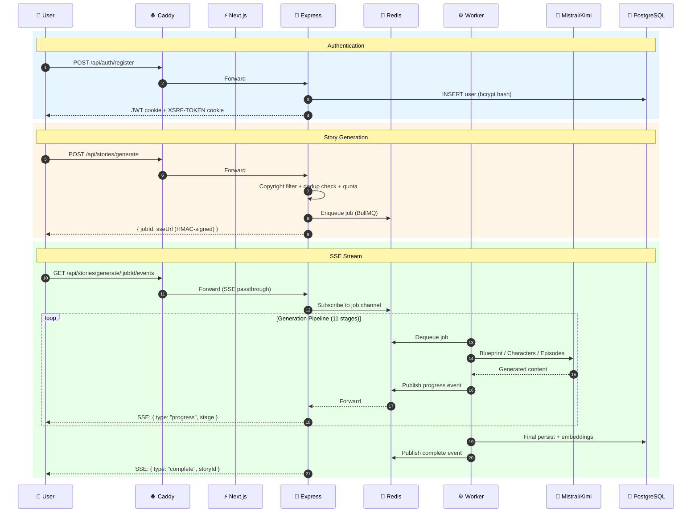
```mermaid
sequenceDiagram
    autonumber
    participant U as 👤 User
    participant C as 🌐 Caddy
    participant FE as ⚡ Next.js
    participant BE as 🔧 Express
    participant R as 🔴 Redis
    participant W as ⚙️ Worker
    participant AI as 🤖 Mistral/Kimi
    participant DB as 🐘 PostgreSQL

    rect rgb(230, 245, 255)
    Note over U,DB: Authentication
    U->>C: POST /api/auth/register
    C->>BE: Forward
    BE->>DB: INSERT user (bcrypt hash)
    BE-->>U: JWT cookie + XSRF-TOKEN cookie
    end

    rect rgb(255, 245, 230)
    Note over U,DB: Story Generation
    U->>C: POST /api/stories/generate
    C->>BE: Forward
    BE->>BE: Copyright filter + dedup check + quota
    BE->>R: Enqueue job (BullMQ)
    BE-->>U: { jobId, sseUrl (HMAC-signed) }
    end

    rect rgb(230, 255, 230)
    Note over U,DB: SSE Stream
    U->>C: GET /api/stories/generate/:jobId/events
    C->>BE: Forward (SSE passthrough)
    BE->>R: Subscribe to job channel

    loop Generation Pipeline (11 stages)
        W->>R: Dequeue job
        W->>AI: Blueprint / Characters / Episodes
        AI-->>W: Generated content
        W->>R: Publish progress event
        R-->>BE: Forward
        BE-->>U: SSE: { type: "progress", stage }
    end

    W->>DB: Final persist + embeddings
    W->>R: Publish complete event
    BE-->>U: SSE: { type: "complete", storyId }
    end
```

---

## 3. AI Generation Pipeline — 11 Stages

```mermaid
graph LR
    G["🎭 Genre"] --> S0
    SE["🌱 Seed"] --> S0

    S0["S0: Budget Gate<br/>🤖 0 calls"] --> S1
    S1["S1: Uniqueness<br/>🤖 0 calls"] --> S2
    S2["S2: Blueprint<br/>🤖 1-2 calls"] --> S3
    S2 --> S4
    S3["S3: Character Bible<br/>🤖 1 call (4 retries)"] --> S5
    S4["S4: World Bible<br/>🤖 1-2 calls"] --> S5
    S5["S5: Episodes 10×5<br/>🤖 10-20 calls"] --> S6
    S6["S6: Story Build<br/>🤖 0 calls"] --> S7
    S7["S7: Humanize<br/>🤖 0 calls"] --> S8
    S8{"S8: Quality Judge<br/>🤖 1 call"}
    S8 -->|"✅ ≥ threshold"| S9
    S8 -->|"❌ < threshold"| S7
    S9["S9: Image/Video Prompts<br/>🤖 0 calls"] --> S10
    S10{"S10: Copyright Sweep<br/>🤖 0 calls"}
    S10 -->|"✅ Clean"| S11
    S10 -->|"❌ Blocked"| REJECT["🚫 Rejected"]
    S11["S11: SEO Metadata<br/>🤖 1 call"] --> OUT["📚 Complete Story"]

    style S0 fill:#f39c12,color:#000
    style S5 fill:#e74c3c,color:#fff
    style S8 fill:#e67e22,color:#fff
    style S10 fill:#e74c3c,color:#fff
    style REJECT fill:#c0392b,color:#fff
    style OUT fill:#2ecc71,color:#fff
```

### Pipeline Checkpoint & Retry

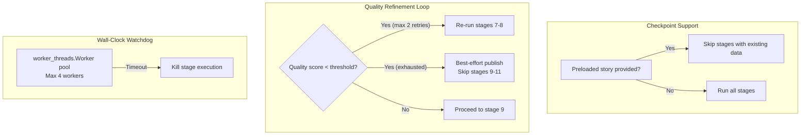
```mermaid
graph TB
    subgraph "Checkpoint Support"
        CP1["Preloaded story provided?"] -->|"Yes"| SKIP["Skip stages with existing data"]
        CP1 -->|"No"| RUN["Run all stages"]
    end

    subgraph "Quality Refinement Loop"
        QF{"Quality score < threshold?"}
        QF -->|"Yes (max 2 retries)"| REFINE["Re-run stages 7-8"]
        QF -->|"Yes (exhausted)"| BESTEFFORT["Best-effort publish<br/>Skip stages 9-11"]
        QF -->|"No"| NEXT["Proceed to stage 9"]
    end

    subgraph "Wall-Clock Watchdog"
        WD["worker_threads.Worker pool<br/>Max 4 workers"]
        WD -->|"Timeout"| KILL["Kill stage execution"]
    end
```

---

## 4. Authentication & Security Layers

### Layer 1: Network Security (Caddy)

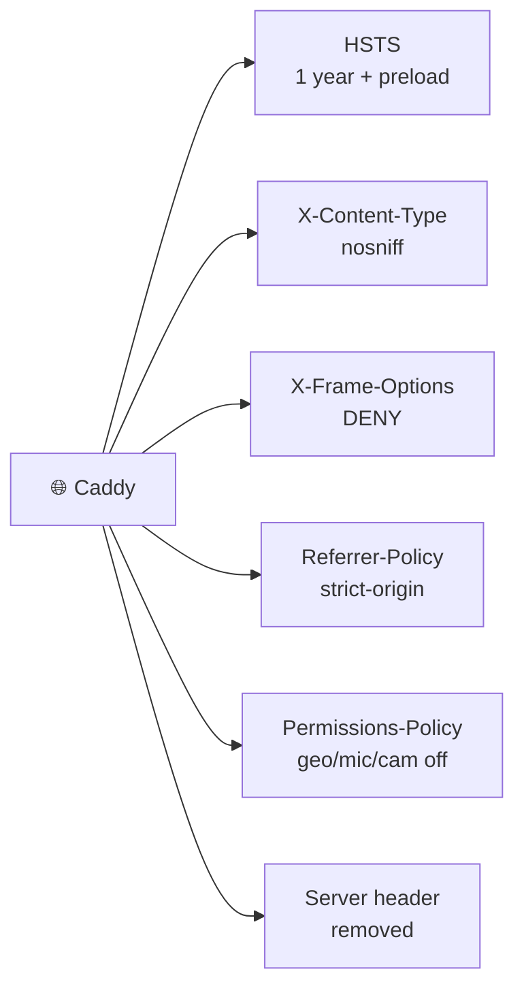
```mermaid
graph LR
    CADDY["🌐 Caddy"] --> HSTS["HSTS<br/>1 year + preload"]
    CADDY --> NOSNIFF["X-Content-Type<br/>nosniff"]
    CADDY --> NOFRAME["X-Frame-Options<br/>DENY"]
    CADDY --> REFERRER["Referrer-Policy<br/>strict-origin"]
    CADDY --> PERMISSION["Permissions-Policy<br/>geo/mic/cam off"]
    CADDY --> NO_SERVER["Server header<br/>removed"]
```

### Layer 2: Rate Limiting

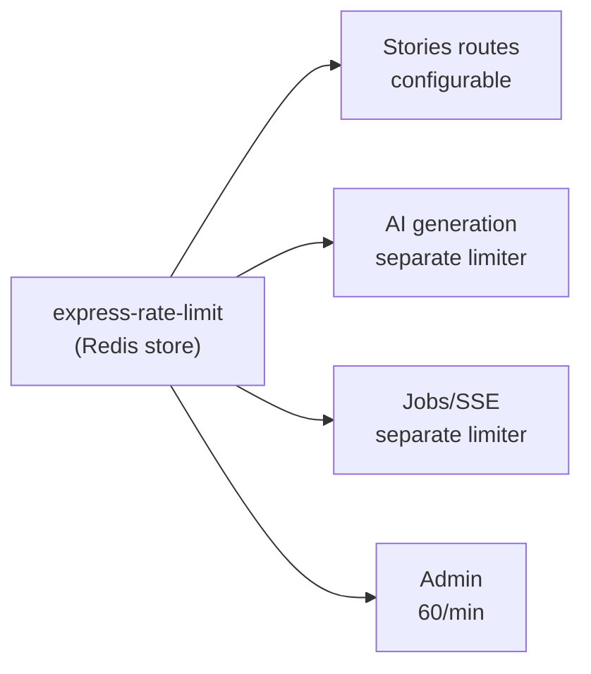
```mermaid
graph LR
    RL["express-rate-limit<br/>(Redis store)"] --> RL1["Stories routes<br/>configurable"]
    RL --> RL2["AI generation<br/>separate limiter"]
    RL --> RL3["Jobs/SSE<br/>separate limiter"]
    RL --> RL4["Admin<br/>60/min"]
```

### Layer 3: Authentication

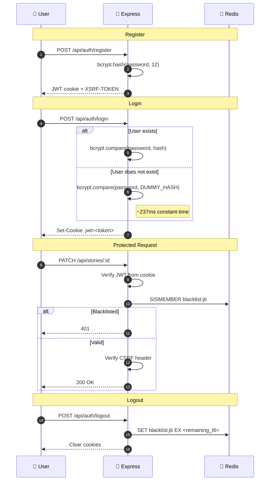
```mermaid
sequenceDiagram
    autonumber
    participant U as 👤 User
    participant BE as 🔧 Express
    participant R as 🔴 Redis

    Note over U,R: Register
    U->>BE: POST /api/auth/register
    BE->>BE: bcrypt.hash(password, 12)
    BE-->>U: JWT cookie + XSRF-TOKEN

    Note over U,R: Login
    U->>BE: POST /api/auth/login
    alt User exists
        BE->>BE: bcrypt.compare(password, hash)
    else User does not exist
        BE->>BE: bcrypt.compare(password, DUMMY_HASH)
        Note right of BE: ~237ms constant-time
    end
    BE-->>U: Set-Cookie: jwt=<token>

    Note over U,R: Protected Request
    U->>BE: PATCH /api/stories/:id
    BE->>BE: Verify JWT from cookie
    BE->>R: SISMEMBER blacklist:jti
    alt Blacklisted
        BE-->>U: 401
    else Valid
        BE->>BE: Verify CSRF header
        BE-->>U: 200 OK
    end

    Note over U,R: Logout
    U->>BE: POST /api/auth/logout
    BE->>R: SET blacklist:jti EX <remaining_ttl>
    BE-->>U: Clear cookies
```

### Layer 4: Input Validation

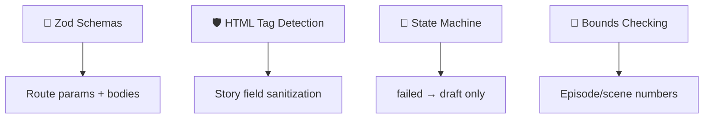
```mermaid
graph TB
    ZOD["📝 Zod Schemas"] --> PARAMS["Route params + bodies"]
    HTML["🛡️ HTML Tag Detection"] --> STORY_FIELDS["Story field sanitization"]
    STATE_MACH["🔄 State Machine"] --> STATUS["failed → draft only"]
    BOUNDS["📏 Bounds Checking"] --> NUMBERS["Episode/scene numbers"]
```

### Layer 5: Content Filtering

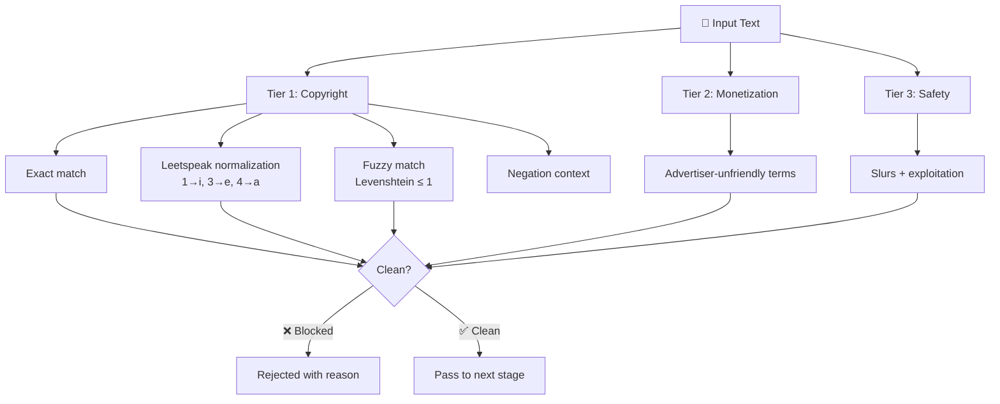
```mermaid
graph TB
    INPUT["📝 Input Text"] --> T1["Tier 1: Copyright"]
    INPUT --> T2["Tier 2: Monetization"]
    INPUT --> T3["Tier 3: Safety"]

    T1 --> C1["Exact match"]
    T1 --> C2["Leetspeak normalization<br/>1→i, 3→e, 4→a"]
    T1 --> C3["Fuzzy match<br/>Levenshtein ≤ 1"]
    T1 --> C4["Negation context"]

    T2 --> M1["Advertiser-unfriendly terms"]
    T3 --> S1["Slurs + exploitation"]

    C1 --> RESULT{"Clean?"}
    C2 --> RESULT
    C3 --> RESULT
    M1 --> RESULT
    S1 --> RESULT

    RESULT -->|"❌ Blocked"| BLOCK["Rejected with reason"]
    RESULT -->|"✅ Clean"| NEXT["Pass to next stage"]
```

---

## 5. Database Schema — Entity Relationships

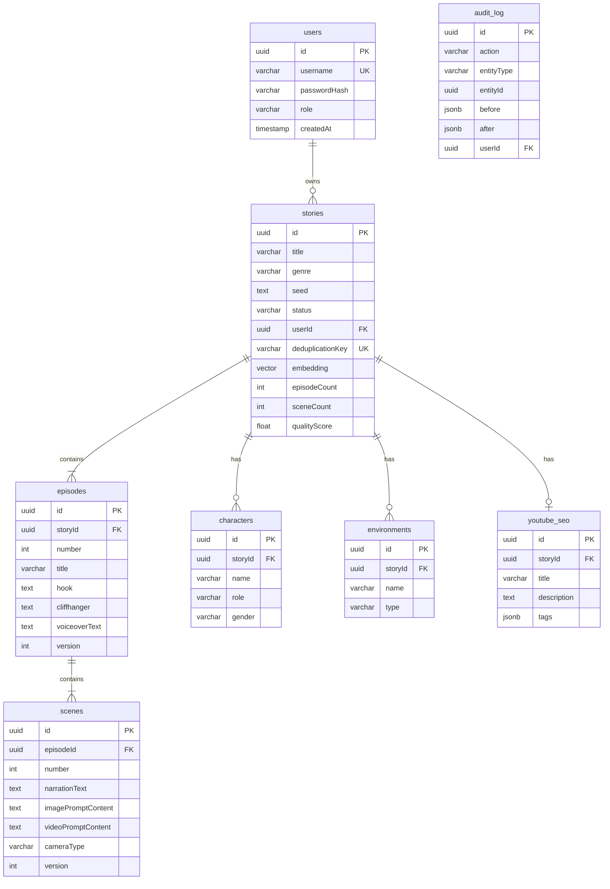
```mermaid
erDiagram
    users {
        uuid id PK
        varchar username UK
        varchar passwordHash
        varchar role
        timestamp createdAt
    }

    stories {
        uuid id PK
        varchar title
        varchar genre
        text seed
        varchar status
        uuid userId FK
        varchar deduplicationKey UK
        vector embedding
        int episodeCount
        int sceneCount
        float qualityScore
    }

    episodes {
        uuid id PK
        uuid storyId FK
        int number
        varchar title
        text hook
        text cliffhanger
        text voiceoverText
        int version
    }

    scenes {
        uuid id PK
        uuid episodeId FK
        int number
        text narrationText
        text imagePromptContent
        text videoPromptContent
        varchar cameraType
        int version
    }

    characters {
        uuid id PK
        uuid storyId FK
        varchar name
        varchar role
        varchar gender
    }

    environments {
        uuid id PK
        uuid storyId FK
        varchar name
        varchar type
    }

    youtube_seo {
        uuid id PK
        uuid storyId FK
        varchar title
        text description
        jsonb tags
    }

    audit_log {
        uuid id PK
        varchar action
        varchar entityType
        uuid entityId
        jsonb before
        jsonb after
        uuid userId FK
    }

    users ||--o{ stories : owns
    stories ||--|{ episodes : contains
    stories ||--o{ characters : has
    stories ||--o{ environments : has
    stories ||--o| youtube_seo : has
    episodes ||--|{ scenes : contains
```

---

## 6. Queue & Worker Architecture

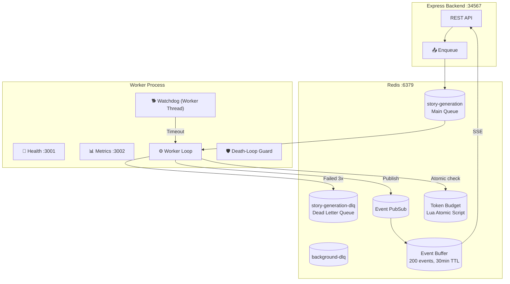
```mermaid
graph TB
    subgraph "Express Backend :34567"
        API["REST API"]
        ENQUEUE["📤 Enqueue"]
    end

    subgraph "Redis :6379"
        MAIN_Q[("story-generation<br/>Main Queue")]
        DLQ[("story-generation-dlq<br/>Dead Letter Queue")]
        BG_DLQ[("background-dlq")]
        EVENTS[("Event PubSub")]
        BUFFER[("Event Buffer<br/>200 events, 30min TTL")]
        BUDGET[("Token Budget<br/>Lua Atomic Script")]
    end

    subgraph "Worker Process"
        HEALTH["💚 Health :3001"]
        METRICS["📊 Metrics :3002"]
        LOOP["⚙️ Worker Loop"]
        WATCHDOG["🐕 Watchdog (Worker Thread)"]
        GUARD["🛡️ Death-Loop Guard"]
    end

    API --> ENQUEUE
    ENQUEUE --> MAIN_Q
    MAIN_Q --> LOOP
    LOOP -->|"Failed 3x"| DLQ
    LOOP -->|"Publish"| EVENTS
    EVENTS --> BUFFER
    BUFFER -->|"SSE"| API
    LOOP -->|"Atomic check"| BUDGET
    WATCHDOG -->|"Timeout"| LOOP
```

### SSE Event Flow

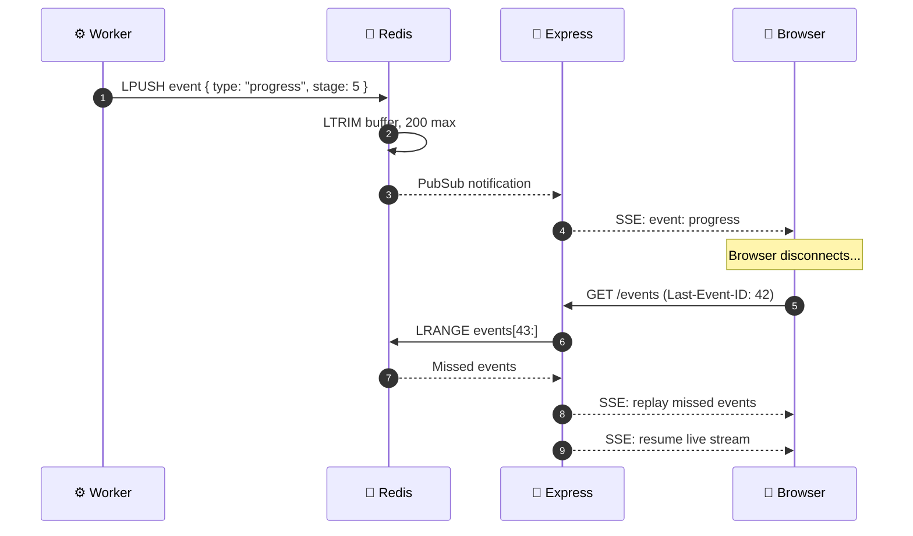
```mermaid
sequenceDiagram
    autonumber
    participant W as ⚙️ Worker
    participant R as 🔴 Redis
    participant BE as 🔧 Express
    participant U as 👤 Browser

    W->>R: LPUSH event { type: "progress", stage: 5 }
    R->>R: LTRIM buffer, 200 max
    R-->>BE: PubSub notification
    BE-->>U: SSE: event: progress

    Note over U: Browser disconnects...

    U->>BE: GET /events (Last-Event-ID: 42)
    BE->>R: LRANGE events[43:]
    R-->>BE: Missed events
    BE-->>U: SSE: replay missed events
    BE-->>U: SSE: resume live stream
```

---

## 7. Copyright & Content Filtering

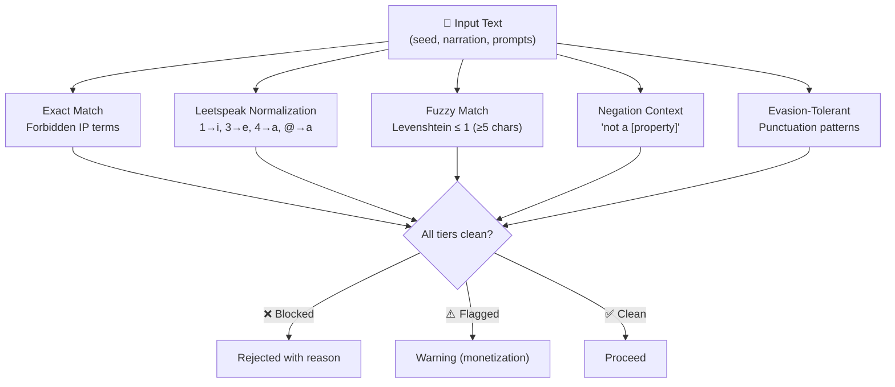
```mermaid
graph TB
    INPUT["📝 Input Text<br/>(seed, narration, prompts)"] --> EXACT["Exact Match<br/>Forbidden IP terms"]
    INPUT --> LEET["Leetspeak Normalization<br/>1→i, 3→e, 4→a, @→a"]
    INPUT --> FUZZY["Fuzzy Match<br/>Levenshtein ≤ 1 (≥5 chars)"]
    INPUT --> NEGATE["Negation Context<br/>'not a [property]'"]
    INPUT --> EVASION["Evasion-Tolerant<br/>Punctuation patterns"]

    EXACT --> DECISION{"All tiers clean?"}
    LEET --> DECISION
    FUZZY --> DECISION
    NEGATE --> DECISION
    EVASION --> DECISION

    DECISION -->|"❌ Blocked"| BLOCK["Rejected with reason"]
    DECISION -->|"⚠️ Flagged"| FLAG["Warning (monetization)"]
    DECISION -->|"✅ Clean"| PASS["Proceed"]
```

---

## 8. Export System — 6 Formats

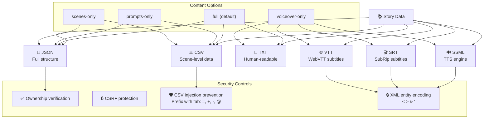
```mermaid
graph TB
    STORY["📚 Story Data"] --> JSON["📄 JSON<br/>Full structure"]
    STORY --> CSV["📊 CSV<br/>Scene-level data"]
    STORY --> TXT["📝 TXT<br/>Human-readable"]
    STORY --> SSML["🔊 SSML<br/>TTS engine"]
    STORY --> SRT["🎬 SRT<br/>SubRip subtitles"]
    STORY --> VTT["🌐 VTT<br/>WebVTT subtitles"]

    subgraph "Content Options"
        FULL["full (default)"]
        PROMPTS["prompts-only"]
        VOICE["voiceover-only"]
        SCENES["scenes-only"]
    end

    subgraph "Security Controls"
        OWN["✅ Ownership verification"]
        CSRF_E["🔒 CSRF protection"]
        INJECT["🛡️ CSV injection prevention<br/>Prefix with tab: =, +, -, @"]
        XML["🔒 XML entity encoding<br/>&lt; &gt; &amp; '"]
    end

    FULL --> JSON
    FULL --> CSV
    FULL --> TXT
    PROMPTS --> JSON
    PROMPTS --> CSV
    VOICE --> TXT
    VOICE --> SSML
    VOICE --> SRT
    VOICE --> VTT
    SCENES --> JSON
    SCENES --> CSV

    JSON --> OWN
    CSV --> INJECT
    SSML --> XML
    SRT --> XML
    VTT --> XML
```

---

## 9. Humanization Pipeline

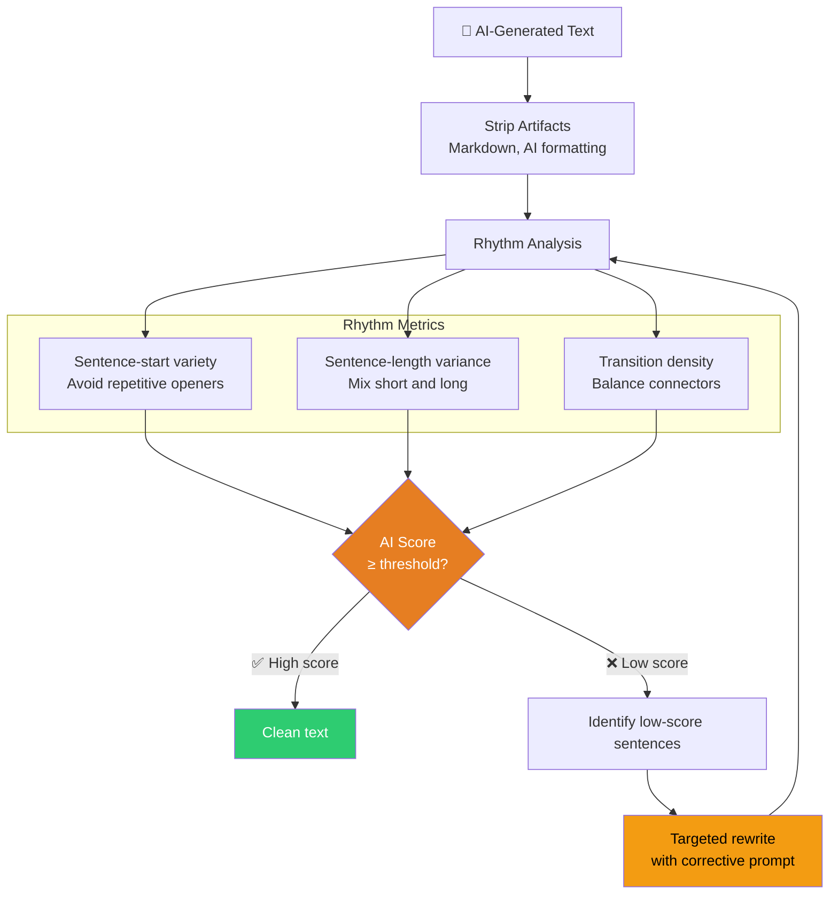
```mermaid
graph TB
    AI_TEXT["🤖 AI-Generated Text"] --> STRIP["Strip Artifacts<br/>Markdown, AI formatting"]
    STRIP --> RHYTHM["Rhythm Analysis"]

    subgraph "Rhythm Metrics"
        SENT_START["Sentence-start variety<br/>Avoid repetitive openers"]
        SENT_LEN["Sentence-length variance<br/>Mix short and long"]
        TRANSITION["Transition density<br/>Balance connectors"]
    end

    RHYTHM --> SENT_START
    RHYTHM --> SENT_LEN
    RHYTHM --> TRANSITION

    SENT_START --> SCORE{"AI Score<br/>≥ threshold?"}
    SENT_LEN --> SCORE
    TRANSITION --> SCORE

    SCORE -->|"✅ High score"| CLEAN["Clean text"]
    SCORE -->|"❌ Low score"| IDENTIFY["Identify low-score sentences"]
    IDENTIFY --> REWRITE["Targeted rewrite<br/>with corrective prompt"]
    REWRITE --> RHYTHM

    style SCORE fill:#e67e22,color:#fff
    style CLEAN fill:#2ecc71,color:#fff
    style REWRITE fill:#f39c12,color:#000
```

---

## 10. Deployment Architecture

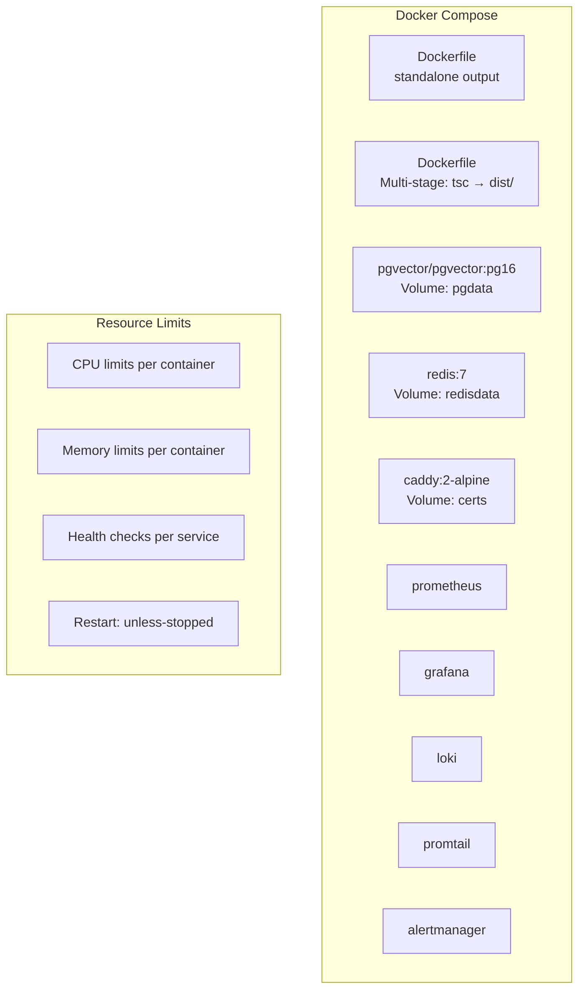
```mermaid
graph TB
    subgraph "Docker Compose"
        FE_D["Dockerfile<br/>standalone output"]
        BE_D["Dockerfile<br/>Multi-stage: tsc → dist/"]
        PG_D["pgvector/pgvector:pg16<br/>Volume: pgdata"]
        REDIS_D["redis:7<br/>Volume: redisdata"]
        CADDY_D["caddy:2-alpine<br/>Volume: certs"]
        PROM_D["prometheus"]
        GRAF_D["grafana"]
        LOKI_D["loki"]
        PROMTAIL_D["promtail"]
        ALERT_D["alertmanager"]
    end

    subgraph "Resource Limits"
        CPU["CPU limits per container"]
        MEM["Memory limits per container"]
        HEALTH["Health checks per service"]
        RESTART["Restart: unless-stopped"]
    end
```

---

## 11. CI/CD Pipeline

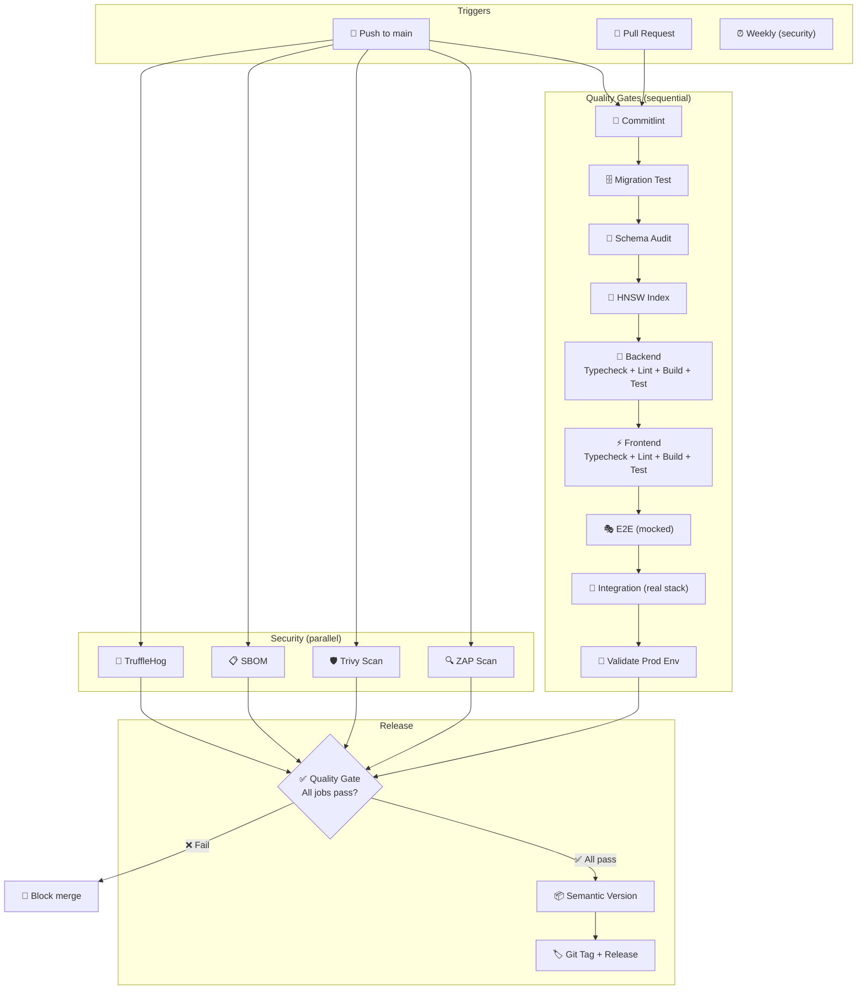
```mermaid
graph TB
    subgraph "Triggers"
        PUSH["🔀 Push to main"]
        PR["🔀 Pull Request"]
        SCHEDULE["⏰ Weekly (security)"]
    end

    subgraph "Quality Gates (sequential)"
        COMMIT["📝 Commitlint"]
        MIGRATE["🗄️ Migration Test"]
        SCHEMA["📐 Schema Audit"]
        HNSW["🧮 HNSW Index"]
        BE_CI["🔧 Backend<br/>Typecheck + Lint + Build + Test"]
        FE_CI["⚡ Frontend<br/>Typecheck + Lint + Build + Test"]
        E2E_CI["🎭 E2E (mocked)"]
        INTEGR["🔗 Integration (real stack)"]
        ENV_CHECK["🔐 Validate Prod Env"]
    end

    subgraph "Security (parallel)"
        ZAP["🔍 ZAP Scan"]
        TRIVY["🛡️ Trivy Scan"]
        SBOM["📋 SBOM"]
        SECRETS["🔑 TruffleHog"]
    end

    subgraph "Release"
        QUALITY{"✅ Quality Gate<br/>All jobs pass?"}
        VERSION["📦 Semantic Version"]
        TAG["🏷️ Git Tag + Release"]
    end

    PUSH --> COMMIT
    PR --> COMMIT
    COMMIT --> MIGRATE --> SCHEMA --> HNSW --> BE_CI --> FE_CI --> E2E_CI --> INTEGR --> ENV_CHECK

    ENV_CHECK --> QUALITY
    PUSH --> ZAP
    PUSH --> TRIVY
    PUSH --> SBOM
    PUSH --> SECRETS
    ZAP --> QUALITY
    TRIVY --> QUALITY
    SBOM --> QUALITY
    SECRETS --> QUALITY

    QUALITY -->|"✅ All pass"| VERSION --> TAG
    QUALITY -->|"❌ Fail"| FAIL["🚫 Block merge"]
```

---

## 12. State Machine — Story Lifecycle

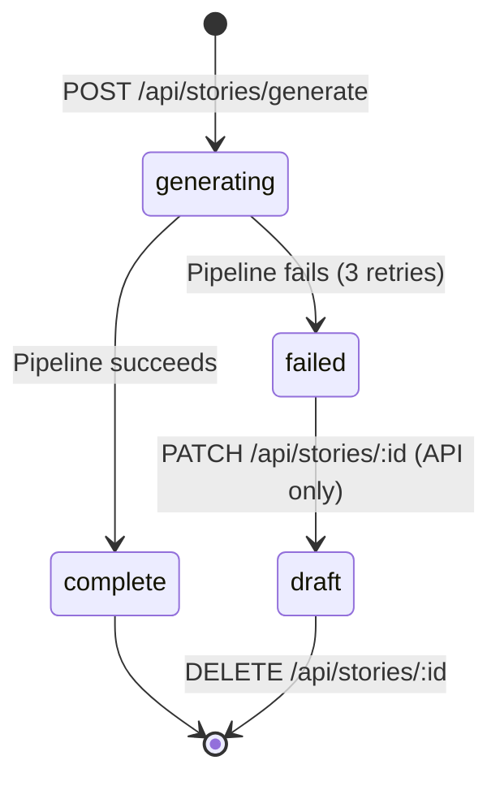
```mermaid
stateDiagram-v2
    [*] --> generating: POST /api/stories/generate

    generating --> complete: Pipeline succeeds
    generating --> failed: Pipeline fails (3 retries)

    complete --> [*]
    failed --> draft: PATCH /api/stories/:id (API only)
    draft --> [*]: DELETE /api/stories/:id
```

---

## 13. Circuit Breaker — AI Providers

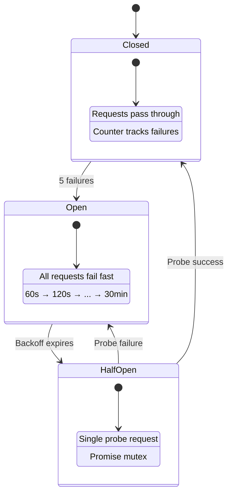
```mermaid
stateDiagram-v2
    [*] --> Closed

    Closed --> Open: 5 failures
    Open --> HalfOpen: Backoff expires
    HalfOpen --> Closed: Probe success
    HalfOpen --> Open: Probe failure

    state Closed {
        [*] --> Normal
        Normal: Requests pass through
        Normal: Counter tracks failures
    }

    state Open {
        [*] --> FastFail
        FastFail: All requests fail fast
        FastFail: 60s → 120s → ... → 30min
    }

    state HalfOpen {
        [*] --> Probe
        Probe: Single probe request
        Probe: Promise mutex
    }
```

---

## 14. Token Budget — Atomic Check & Increment

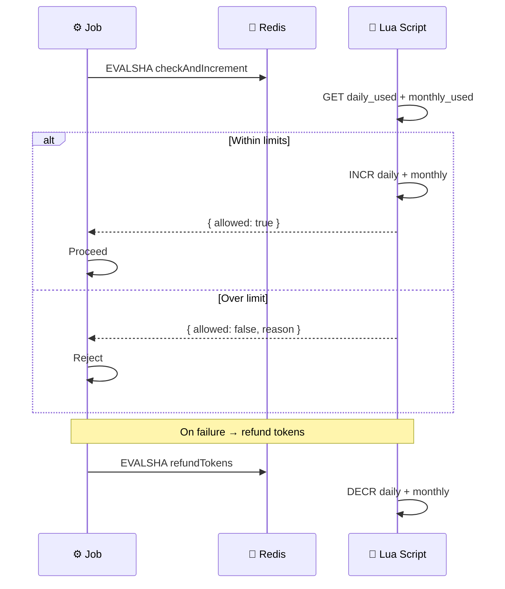
```mermaid
sequenceDiagram
    participant JOB as ⚙️ Job
    participant REDIS as 🔴 Redis
    participant LUA as 📜 Lua Script

    JOB->>REDIS: EVALSHA checkAndIncrement
    LUA->>LUA: GET daily_used + monthly_used

    alt Within limits
        LUA->>LUA: INCR daily + monthly
        LUA-->>JOB: { allowed: true }
        JOB->>JOB: Proceed
    else Over limit
        LUA-->>JOB: { allowed: false, reason }
        JOB->>JOB: Reject
    end

    Note over JOB,LUA: On failure → refund tokens
    JOB->>REDIS: EVALSHA refundTokens
    LUA->>LUA: DECR daily + monthly
```

---

## 15. Observability Stack

```mermaid
graph TB
    BE_LOG["📝 Express Logs"] --> PROMTAIL["📤 Promtail"]
    WORKER_LOG["📝 Worker Logs"] --> PROMTAIL
    BE_MET["📊 Express Metrics"] --> PROM["📊 Prometheus"]
    WORKER_MET["📊 Worker Metrics"] --> PROM

    PROMTAIL --> LOKI["📋 Loki"]
    PROM --> TSDB["💾 TSDB"]

    LOKI --> GRAF["📈 Grafana"]
    TSDB --> GRAF

    PROM --> ALERT["🚨 Alertmanager"]
    ALERT --> RULES["6 alert conditions"]
```

---

## 16. Frontend Component Hierarchy

```mermaid
graph TB
    ROOT["app/layout.tsx<br/>Inter, dark theme, ErrorBoundary"]

    ROOT --> SHELL["AppShell"]
    SHELL --> SIDEBAR["Sidebar"]
    SHELL --> TOPNAV["TopNav"]
    SHELL --> CONTENT["Page Content"]

    CONTENT --> DASHBOARD["/ Dashboard<br/>Story grid, infinite scroll"]
    CONTENT --> CREATE["/create<br/>Genre + Seed + Progress"]
    CONTENT --> STORY["/story/[id]<br/>Episodes + Scenes"]
    CONTENT --> SETTINGS["/settings<br/>User preferences"]
    CONTENT --> ADMIN["/admin<br/>Queue, DLQ, Settings"]

    STORY --> HEADER["StoryHeader"]
    STORY --> TABS["Overview | Prompts | SEO"]
    STORY --> EP_CARD["EpisodeCard"]
    EP_CARD --> SCENE["SceneRow"]
    SCENE --> EDITOR["InlineEditor"]

    CREATE --> GEN_MODAL["GenerationModal"]
    GEN_MODAL --> GEN_SELECTOR["GenreSelector (21)"]
    GEN_MODAL --> GEN_SEED["SeedInput"]
    GEN_MODAL --> GEN_PREVIEW["GenerationPreview (SSE)"]
```

---

## 17. Security Posture Summary

```mermaid
graph LR
    subgraph "Strengths ✅"
        S1["JWT blacklisting"]
        S2["CSRF double-submit"]
        S3["SSRF + DNS pinning"]
        S4["Copyright filtering"]
        S5["Rate limiting"]
        S6["Zod validation"]
        S7["bcrypt + dummy hash"]
        S8["Advisory lock"]
        S9["Credential redaction"]
        S10["ZAP + Trivy"]
    end

    subgraph "Improvements Needed ⚠️"
        I1["No explicit XSS sanitization"]
        I2["No CSP on frontend"]
        I3["No account lockout"]
        I4["No global IP rate limit"]
    end
```

---

*Generated from exhaustive line-by-line analysis of all 420+ files in the repository.*
*See `AUDIT-2026-07-19.md` for the complete audit report.*
